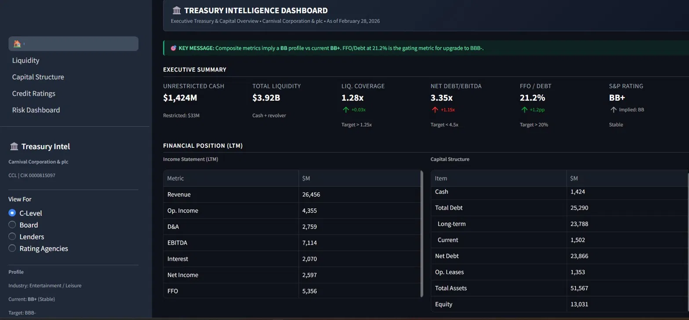
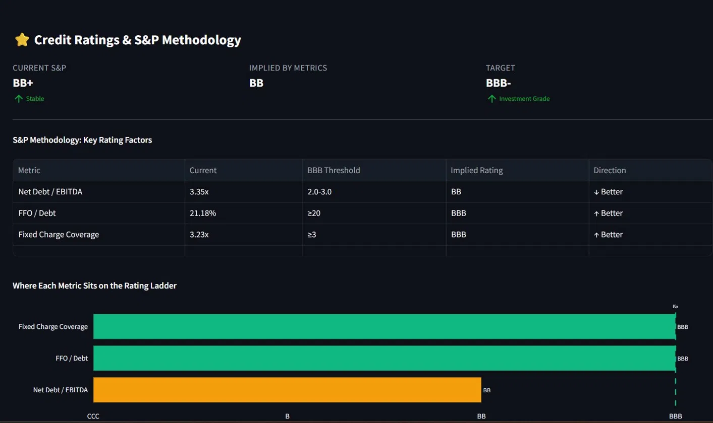
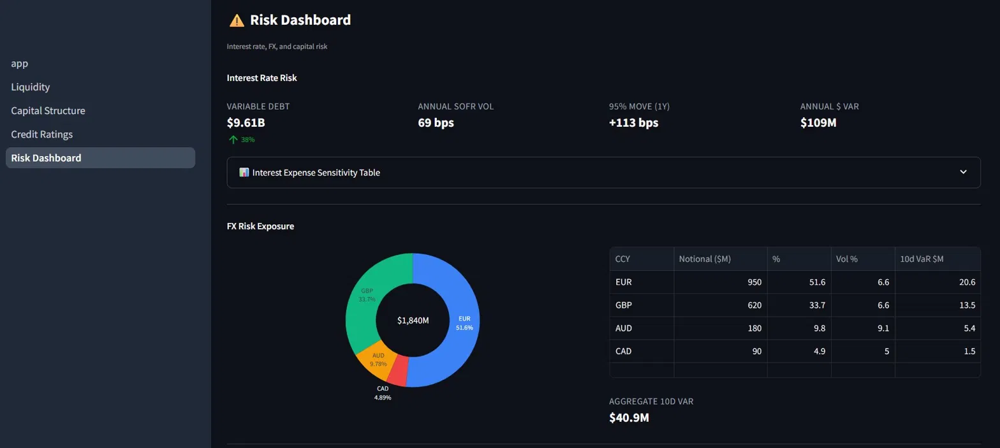
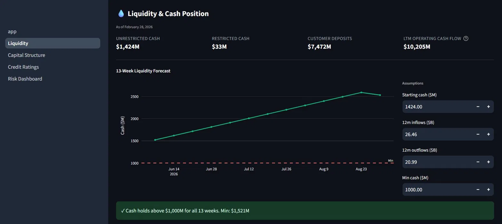

# 🏛️ Treasury Intelligence Dashboard

[](https://www.python.org/downloads/)
[](https://streamlit.io)
[](https://opensource.org/licenses/MIT)
[](https://treasury-ccl-bsarfo.streamlit.app)

> **An executive treasury & credit dashboard built entirely from public data** — pulls real-time rates from the Federal Reserve (FRED), real financial filings from SEC EDGAR (XBRL), and uses Claude AI to generate audience-aware credit narratives. Currently configured for **Carnival Corporation (NYSE: CCL)**, a BB+ rated cruise operator one notch from investment grade.

[**🌐 Live Demo →**](https://treasury-ccl-bsarfo.streamlit.app)

---

## 📊 What it does

This dashboard is what a CFO, credit committee, or rating agency analyst would want to see at a glance for a non-investment-grade public company. It answers four questions:

1. **Are we liquid?** — 13-week cash forecast with seasonality, threshold alerts, customer deposit tracking
2. **What's our capital structure?** — debt maturity wall, fixed/floating mix, weighted avg cost
3. **Where are we vs the next rating upgrade?** — S&P methodology comparison, metric-by-metric implied rating, action plan
4. **Where does risk concentrate?** — Interest Rate VaR using live SOFR vol, FX exposure VaR by currency, scenario stress tester

The dashboard auto-detects three audiences (C-Level, Board, Lenders, Rating Agencies) and rewrites the Key Message banner accordingly using Claude AI when an API key is provided — with deterministic fallback templates when it's not.

---

## 🖼️ Screenshots

### Executive Overview — six headline KPI tiles + Income Statement / Capital Structure tables


### Credit Ratings — S&P methodology benchmarking with rating-ladder visualization

> The orange bar reveals the story: Net Debt/EBITDA is the bottleneck. FFO/Debt and Fixed Charge Coverage are already at BBB territory.

### Risk Dashboard — Interest Rate VaR + FX exposure + scenario stress tests


### 13-Week Liquidity Forecast — interactive seasonal cash model


---

## 🧩 Architecture

```
Dashboard-CCL/
├── app.py                          # Main entry — KPI tiles + audience selector
├── src/
│   ├── config.py                   # Company info + FRED series IDs + S&P thresholds
│   ├── fred_client.py              # FRED API wrapper (rates, FX, credit spreads)
│   ├── sec_client.py               # SEC EDGAR XBRL client
│   ├── data_loader.py              # Period-aware LTM rollup engine
│   ├── treasury_metrics.py         # Credit ratio calcs (Net Debt/EBITDA, FFO/Debt, FCC)
│   ├── liquidity_forecast.py       # 13-week seasonal cash forecast
│   ├── risk_engine.py              # IR VaR, FX VaR, debt maturity wall
│   ├── ai_narrator.py              # Claude API wrapper with fallback templates
│   └── layout.py                   # Shared compact CSS for laptop-screen fit
├── pages/
│   ├── 1_Liquidity.py
│   ├── 2_Capital_Structure.py
│   ├── 3_Credit_Ratings.py
│   └── 4_Risk_Dashboard.py
├── tests/
│   └── test_ltm_rollup.py          # Period-aware LTM tests
├── .streamlit/
│   └── config.toml                 # Dark theme + headless mode
└── requirements.txt
```

---

## 🚀 Run it locally

### Prerequisites
- Python 3.11+
- A free [FRED API key](https://fred.stlouisfed.org/docs/api/api_key.html) (instant)
- *(Optional)* an [Anthropic API key](https://console.anthropic.com/) for AI narratives — works without one

### Setup

```bash
git clone https://github.com/bsarfo/treasury-intelligence-dashboard.git
cd treasury-intelligence-dashboard

python -m venv venv
source venv/bin/activate     # Windows: venv\Scripts\activate
pip install -r requirements.txt

cp .env.example .env
# Edit .env with your FRED_API_KEY and SEC_USER_AGENT (your name + email)
```

### Verify the data layer works

```bash
# Run the unit tests (validates LTM rollup against Carnival ground-truth)
python tests/test_ltm_rollup.py

# Smoke test the live data clients
python -m src.fred_client
python -m src.sec_client
```

### Launch the dashboard

```bash
streamlit run app.py
```

Open http://localhost:8501 in your browser.

---

## 🔧 Configure for a different company

Edit `src/config.py`:

```python
COMPANY = {
    "name":            "Your Company Inc.",
    "ticker":          "TICK",
    "cik":             "0000123456",         # 10-digit, zero-padded SEC CIK
    "industry":        "Sector",
    "fiscal_year_end_month": 12,
    "current_sp_rating":     "BB",
    "current_outlook":       "Stable",
    "target_rating":         "BBB-",
}
```

Find any public company's CIK at [SEC EDGAR](https://www.sec.gov/cgi-bin/browse-edgar?action=getcompany). Restart the dashboard — every metric, narrative, and chart will recompute against that company's filings.

---

## 🧠 Methodology notes

### LTM rollup (the hardest part)

SEC EDGAR's XBRL JSON mixes two period types: **10-K rows** (full fiscal-year totals) and **10-Q rows** (single quarterly values). Naively summing the latest 4 rows breaks when both types are present — it can inflate LTM by 50-100%. `data_loader.py` solves this by:

1. Tagging each fact as `is_quarter` (Q1/Q2/Q3 from 10-Q) or `is_annual` (10-K with `fp=FY`)
2. If 4+ pure quarterly facts exist: sum the last 4
3. Otherwise: **LTM = most-recent-FY + current-FY-YTD - prior-FY-YTD** (matched by fiscal period)
4. Edge cases (only annuals, only partial quarters) handled with explicit fallbacks

Validated against Carnival's reported Q1 2026 + FY2025 figures.

### S&P methodology

Rating thresholds in `src/config.py` come from S&P Global Ratings' Corporate Methodology. The composite rating logic takes the **most conservative** (worst) implied rating across the three core metrics — same approach S&P uses internally for "anchor" ratings.

### AI narratives

`src/ai_narrator.py` defines deterministic data-aware fallback templates for every AI-generated section. The Claude API is called only if `ANTHROPIC_API_KEY` is set; otherwise the dashboard runs without it, just with simpler prose. **The dashboard works perfectly with no API key.**

---

## 📡 Data sources

| Source | What | License |
|---|---|---|
| [FRED](https://fred.stlouisfed.org) (Federal Reserve) | SOFR, Treasury yields, credit spreads, FX rates, macro indicators | Public domain |
| [SEC EDGAR](https://www.sec.gov/edgar) (XBRL) | Carnival 10-K / 10-Q financial filings | Public domain |
| Yahoo Finance via `yfinance` | Equity prices (supplementary) | Free for personal use |

---

## ⚠️ Disclaimers

- **Not investment advice.** This dashboard is built for educational and portfolio purposes. Figures are derived from publicly available filings and may lag real-time market conditions.
- **Representative inputs.** Debt maturity schedules and fixed/floating mix are illustrative — refine from the 10-K Notes on Long-Term Debt for production use.
- **No affiliation** with Carnival Corporation, Anthropic, the Federal Reserve, or the SEC.

---

## 🛠️ Built with

- [Streamlit](https://streamlit.io) — UI framework
- [Plotly](https://plotly.com/python) — interactive charts
- [pandas](https://pandas.pydata.org) + [numpy](https://numpy.org) — data processing
- [scipy](https://scipy.org) — statistical VaR calcs
- [fredapi](https://github.com/mortada/fredapi) — FRED client
- [Anthropic Python SDK](https://github.com/anthropics/anthropic-sdk-python) — Claude API integration

---

## 📬 About

Built by **Bismark Kofi Owusu Sarfo** as a fintech portfolio project demonstrating end-to-end financial data engineering, credit analysis, and AI integration.

[LinkedIn](https://linkedin.com) • [GitHub](https://github.com/bsarfo)

---

## 📜 License

MIT — see [LICENSE](LICENSE).
